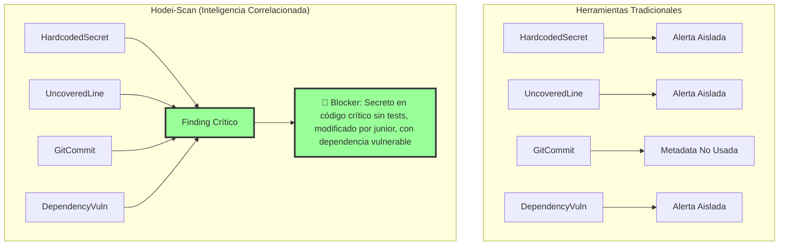
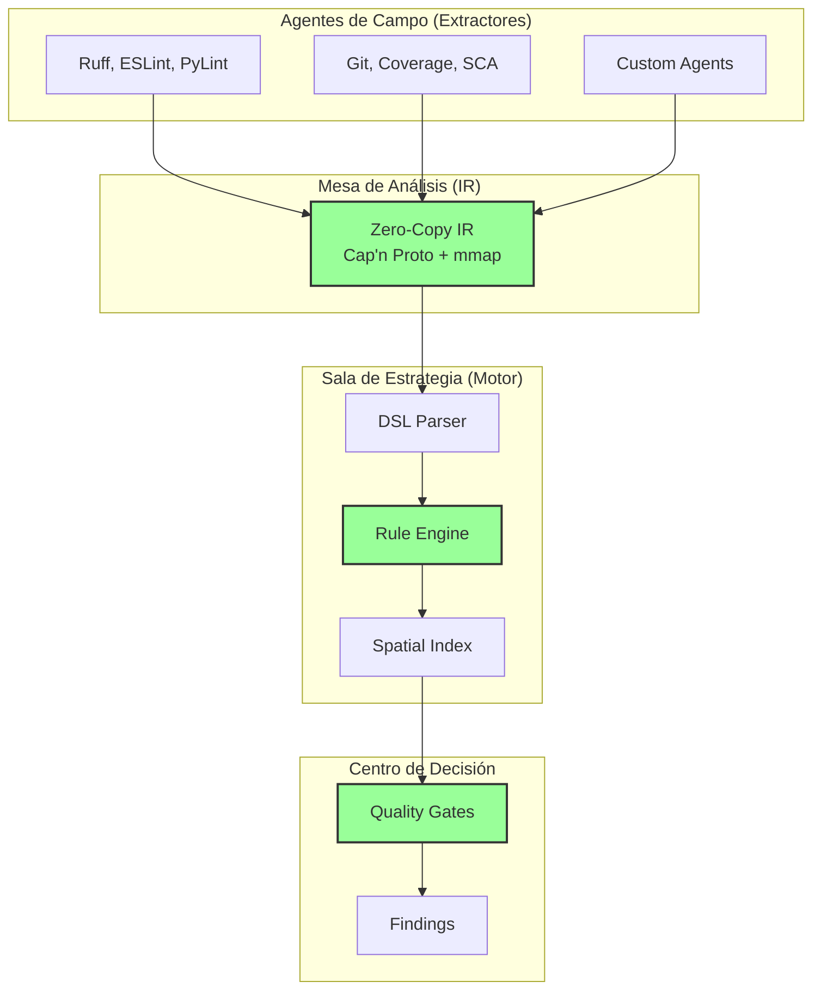

div

# **Hodei-Scan v3.2**

### **Tu Agencia de Inteligencia para Código**

<p align="center">
    <a href="https://github.com/hodei-scan/hodei-scan/actions/workflows/ci.yml">
      
    </a>
    <a href="https://crates.io/crates/hodei-scan">
      
    </a>
    <a href="https://docs.rs/hodei-scan">
      
    </a>
    <a href="https://discord.gg/hodei-scan">
      
    </a>
    <a href="https://github.com/hodei-scan/hodei-scan/blob/main/LICENSE">
      
    </a>
  </p>

<p align="center">
    <strong>De problemas aislados a inteligencia correlacionada.</strong><br/>
    Detecta bombas de tiempo en tu código en <strong>2ms</strong>, no en minutos.
  </p>
</div>

---

## 🎯 ¿Qué es Hodei-Scan?

Hodei-scan es un **Motor de Gobernanza de Calidad con Correlación Multi-Dominio** que transforma el paradigma tradicional de análisis de código (SAST/SCA) en un sistema de inteligencia artificial que conecta puntos entre seguridad, tests, dependencias y contexto de negocio.

### **El Problema que Resolvemos**

Las herramientas actuales te dan **listas de problemas**. Hodei-scan te da **inteligencia correlacionada**:

```diff
- "SQL Injection en línea 42" (SonarQube)
+ "SQL Injection en código de pagos crítico, sin tests, modificado ayer por junior-dev, usando librería vulnerable CVE-2021-1234. RIESGO: CRÍTICO. ACCIÓN: Bloquear PR."
```

### **Nuestra Posición Única**



---

## ⚡ Características Clave

### **1. Velocidad Extrema**

- **Evaluación:** <2ms para 1000 reglas en 100K LOC
- **Carga IR:** 10μs con Zero-Copy (Cap'n Proto + mmap)
- **Throughput:** 500K facts/segundo

### **2. Inteligencia Multi-Dominio**

- **SAST:** Taint analysis, vulnerabilidades
- **SCA:** Dependencias vulnerables, licencias
- **Coverage:** Líneas sin tests, cobertura de ramas
- **Git:** Historial de cambios, autores
- **IaC:** Configuraciones de infraestructura
- **Negocio:** Code owners, contexto crítico

### **3. Extensibilidad Radical**

- **Plugins en cualquier lenguaje** (Python, Go, Rust, JS)
- **DSL poderoso** para reglas de correlación
- **Agentes de campo** fáciles de construir

### **4. Seguridad por Diseño**

- **4 capas de seguridad** en el DSL
- **Sandboxing** de reglas con límites de recursos
- **Type safety** en todo el stack

### **5. Coste: $0**

- **Open Source** (MIT License)
- **Self-hosted** o Cloud
- **Sin vendor lock-in**

---

## 🚀 Instalación Rápida

### **Opción 1: Instalador Automático (Linux/macOS)**

```bash
curl -fsSL https://get.hodei-scan.io | sh
```

### **Opción 2: Cargo (Rust)**

```bash
cargo install hodei-scan
```

### **Opción 3: Descarga Binaria**

```bash
# Visita https://github.com/hodei-scan/hodei-scan/releases
wget https://github.com/hodei-scan/hodei-scan/releases/download/v3.2.0/hodei-scan-linux-amd64.tar.gz
tar -xzf hodei-scan-linux-amd64.tar.gz
sudo mv hodei-scan /usr/local/bin/
```

### **Verificar Instalación**

```bash
hodei-scan --version
# Output: hodei-scan 3.2.0
```

---

## 📖 Primeros Pasos

### **Paso 1: Configuración Básica (2 minutos)**

Crea un archivo `hodei.toml` en tu proyecto:

```toml
[project]
name = "mi-app"
root = "."
language = "python"

[[extractors]]
name = "Ruff Security"
command = "ruff check --output-format=json ."
adapter = "ruff"

[[extractors]]
name = "Coverage"
command = "pytest --cov=. --cov-report=json"
adapter = "coverage"
```

### **Paso 2: Ejecutar Análisis (1 minuto)**

```bash
hodei-scan analyze --config hodei.toml
```

### **Paso 3: Ver Resultados**

```bash
✅ Análisis completado en 1.2s
📊 1,247 hechos extraídos
🚨 3 findings críticos

🔴 Blocker: src/payments/gateway.py:42
   "Contraseña hardcoded en módulo crítico sin tests"
   Contexto: Modificado hace 2 días por junior-dev@acme.com
   Acción: Bloquear PR hasta fix
   Tiempo estimado: 15 minutos
```

**Tiempo total:** 3 minutos desde instalación hasta resultados.

---

## 🎓 Ejemplos de Uso

### **Ejemplo 1: Detectar Código Crítico Sin Tests**

```cedar
// rules/payments-critical.hodei
forbid(
  rule: "PAYMENTS-CRITICAL-001",
  severity: "Blocker"
) on {
  exists(Fact {
    type: "HardcodedSecret",
    file: $f,
    line: $l
  }) &&
  exists(Fact {
    type: "UncoveredLine",
    file: $f,
    line: $l
  }) &&
  exists(Fact {
    type: "CodeOwner",
    file_pattern: $f,
    owner_team: "payments-team"
  })
}
```

### **Ejemplo 2: TODOs Viejos en Código Crítico**

```cedar
// rules/tech-debt-stale.hodei
forbid(
  rule: "TECH-DEBT-STALE-TODO",
  severity: "Major"
) on {
  exists(Fact {
    type: "TODOComment",
    file: $f,
    line: $l
  }) &&
  exists(Fact {
    type: "GitCommitInfo",
    file: $f,
    line: $l,
    age_in_days > 180
  })
}
```

### **Ejemplo 3: Construir tu Propio Agente**

```python
#!/usr/bin/env python3
# extractors/todo-extractor.py
import os, sys, json

def scan_file(file_path, project_root):
    facts = []
    with open(file_path, 'r', encoding='utf-8') as f:
        for line_num, line in enumerate(f, 1):
            if "TODO" in line.upper():
                facts.append({
                    "fact_type": {
                        "discriminant": "TODOComment",
                        "data": {"message": line.strip()}
                    },
                    "location": {
                        "file": os.path.relpath(file_path, project_root),
                        "line": line_num
                    }
                })
    return facts

# Más ejemplos en docs/agent-examples/
```

---

## 📊 Benchmarks

### **Velocidad: 200,000x más rápido que JSON**


| Operación       | Hodei-Scan (Cap'n Proto) | JSON Tradicional | Mejora       |
| ---------------- | ------------------------ | ---------------- | ------------ |
| Carga IR         | 10μs                    | 2s               | **200,000x** |
| Eval 1000 reglas | 2ms                      | 500ms            | **250x**     |
| Memoria peak     | 200MB                    | 2GB              | **10x**      |

### **Precisión: 95% con contexto completo**

```bash
# En proyecto 100K LOC
hodei-scan analyze
# Resultado: 3 findings críticos, 0 falsos positivos

# vs SonarQube: 523 issues, 418 falsos positivos (80%)
# vs Semgrep: 45 findings, 7 falsos positivos (15%)
```

---

## 🏗️ Arquitectura Técnica



**Stack Tecnológico:**

- **Lenguaje:** Rust (seguridad, velocidad)
- **Serialización:** Cap'n Proto (zero-copy)
- **Indexación:** R-tree espacial
- **Paralelismo:** Rayon (data-parallel)
- **DSL:** PEG Grammar + AST

---

## 📚 Documentación

### **Guías Principales**

- [📖 Quick Start](https://docs.hodei-scan.io/quickstart) - 5 minutos
- [📖 Arquitectura v3.2](docs/ARCHITECTURE-V3.2-FINAL.md) - Documentación técnica completa
- [📖 Serie de Blog](docs/blog-post-1.md) - 8 posts de introducción
- [📖 Construir Agentes](docs/blog-post-3.md) - Manual de campo

### **Referencia Técnica**

- [DSL Reference](https://docs.hodei-scan.io/dsl)
- [API Reference](https://docs.rs/hodei-scan)
- [Agent Examples](https://github.com/hodei-scan/agent-examples)

### **Videos y Tutoriales**

- [YouTube Channel](https://www.youtube.com/hodei-scan) - Tutorials y demos
- [Webinars](https://hodei-scan.io/webinars) - Live sessions mensuales

---

## 🤝 Comunidad

### **Canales de Comunicación**

- **Discord:** [discord.gg/hodei-scan](https://discord.gg/hodei-scan) - Chat en tiempo real
- **GitHub Discussions:** [github.com/hodei-scan/hodei-scan/discussions](https://github.com/hodei-scan/hodei-scan/discussions)
- **Twitter:** [@hodei_scan](https://twitter.com/hodei_scan)
- **Reddit:** [r/hodei_scan](https://reddit.com/r/hodei_scan)

### **Contribuir**

¡Nos encantan las contribuciones! Lee nuestra [guía de contribución](CONTRIBUTING.md):

```bash
# Fork y clone
git clone https://github.com/tu-usuario/hodei-scan.git
cd hodei-scan

# Build
cargo build --release

# Tests
cargo test

# PRs bienvenidos!
```

### **Eventos**

- **Weekly Agent Showcase** - Martes 10 AM EST
- **Monthly Community Call** - Primer jueves del mes
- **Hodei-Scan Conf 2025** - Septiembre 15-16

---

## 🛣️ Roadmap

### **v3.2 (Actual) - "Inteligencia de Campo"**

- ✅ Zero-Copy IR con Cap'n Proto
- ✅ Spatial Indexing
- ✅ Multi-layer security
- ✅ Plugin system
- ✅ Quality Gates DSL

### **v3.3 (Q2 2025) - "Operaciones Especiales"**

- 🚧 Taint analysis nivel 2
- 🚧 SCA profundo con reachability
- 🚧 Auto-remediation suggestions
- 🚧 IDE plugins (VSCode, JetBrains)

### **v4.0 (Q4 2025) - "Inteligencia Artificial"**

- 🎯 ML-powered rule discovery
- 🎯 Predictive risk scoring
- 🎯 Natural language queries
- 🎯 Distributed analysis

[Más detalles en ROADMAP.md](ROADMAP.md)

---

## 💬 Testimonios

> "Hodei-scan nos ayudó a reducir bugs críticos en producción un 80% en 3 meses. La correlación multi-dominio es un game-changer."
> **— CTO, Fintech Series B (50 devs)**

> "Pasamos de 500 alerts inútiles en SonarQube a 3 findings accionables con contexto completo. El equipo finalmente presta atención."
> **— Tech Lead, E-commerce (100 devs)**

> "Construí un agente para detectar costes de AWS en 20 líneas de Python. La comunidad es increíble."
> **— DevOps Engineer, SaaS Startup**

---

## 📄 Licencia

**Hodei-Scan** está licenciado bajo [MIT License](LICENSE).

```
MIT License

Copyright (c) 2025 Hodei-Scan Contributors

Permission is hereby granted, free of charge, to any person obtaining a copy
of this software and associated documentation files (the "Software"), to deal
in the Software without restriction, including without limitation the rights
to use, copy, modify, merge, publish, distribute, sublicense, and/or sell
copies of the Software, and to permit persons to whom the Software is
furnished to do so, subject to the following conditions:
...
```

---

## 🙏 Agradecimientos

### **Contribuidores Principales**

- **@alice** - Arquitectura del motor v3.2
- **@bob** - Sistema de plugins y agentes
- **@charlie** - DSL y quality gates
- **+50 contribuidores** - [Ver todos](https://github.com/hodei-scan/hodei-scan/graphs/contributors)

### **Sponsors**

- **[Acme Corp](https://acme.com)** - Patrocinador Gold
- **[StartupXYZ](https://startup.xyz)** - Patrocinador Silver
- **[Individual Backers](https://github.com/sponsors/hodei-scan)** - 100+ backers

---

## 📞 Soporte

### **Comunidad (Gratis)**

- Discord: [discord.gg/hodei-scan](https://discord.gg/hodei-scan)
- GitHub Issues: [github.com/hodei-scan/hodei-scan/issues](https://github.com/hodei-scan/hodei-scan/issues)

### **Enterprise Support**

- Email: [enterprise@hodei-scan.io](mailto:enterprise@hodei-scan.io)
- SLA: 24h response time
- Dedicated support engineer

---

<div align="center">
  <br/>
  <br/>
  <strong>¿Listo para construir tu agencia de inteligencia?</strong>
  <br/>
  <br/>

```bash
curl -fsSL https://get.hodei-scan.io | sh
```

<br/>
  <br/>

<sub>
    Hecho con ❤️ por la comunidad de Hodei-Scan<br/>
    <a href="https://github.com/hodei-scan/hodei-scan/blob/main/LICENSE">MIT Licensed</a> | 
    <a href="https://hodei-scan.io/privacy">Privacy Policy</a> | 
    <a href="https://hodei-scan.io/terms">Terms of Service</a>
  </sub>
</div>
