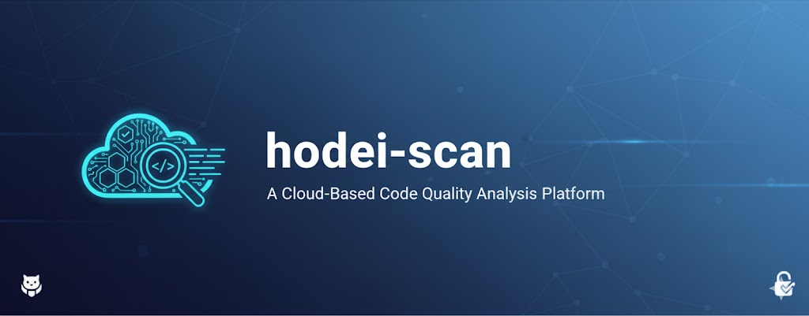
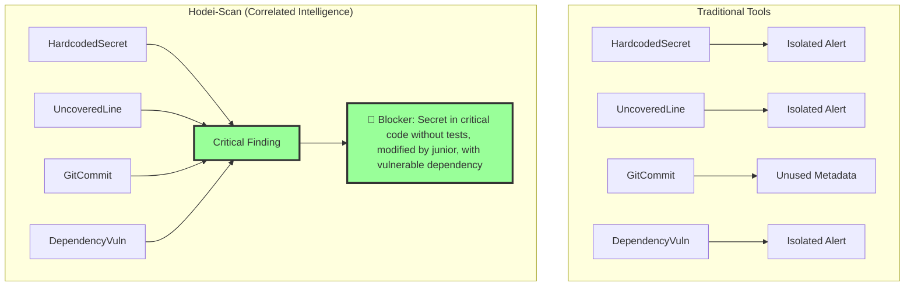
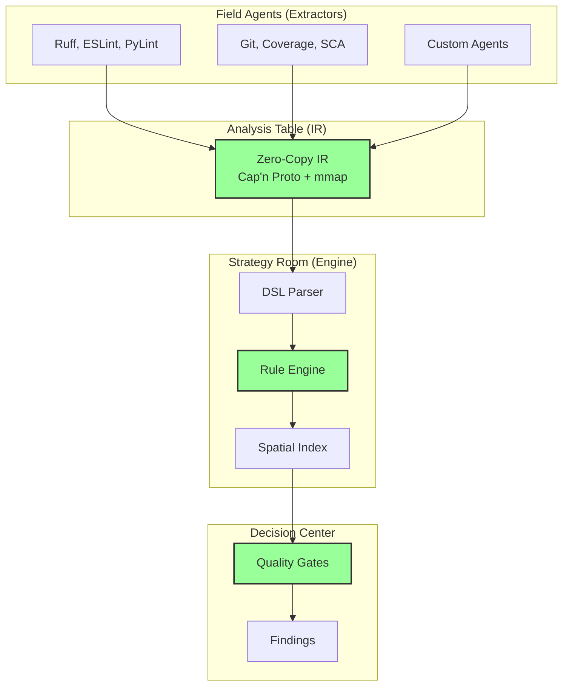

<div align="center">
  

# **Hodei-Scan**

### **Your Intelligence Agency for Code**

<p align="center">
    <a href="https://github.com/hodei-scan/hodei-scan/actions/workflows/ci.yml">
      
    </a>
    <a href="https://crates.io/crates/hodei-scan">
      
    </a>
    <a href="https://docs.rs/hodei-scan">
      
    </a>
    <a href="https://discord.gg/hodei-scan">
      
    </a>
    <a href="https://github.com/hodei-scan/hodei-scan/blob/main/LICENSE">
      
    </a>
  </p>

<p align="center">
    <strong>From isolated problems to correlated intelligence.</strong><br/>
    Detect time bombs in your code in <strong>2ms</strong>, not minutes.
  </p>
</div>

---

## 🎯 What is Hodei-Scan?

Hodei-scan is a **Multi-Domain Governance Quality Engine** that transforms the traditional code analysis paradigm (SAST/SCA) into an artificial intelligence system that connects dots between security, tests, dependencies, and business context.

### **The Problem We Solve**

Current tools give you **lists of problems**. Hodei-scan gives you **correlated intelligence**:

```diff
- "SQL Injection on line 42" (SonarQube)
+ "SQL Injection in critical payments code, without tests, modified yesterday by junior-dev, using vulnerable library CVE-2021-1234. RISK: CRITICAL. ACTION: Block PR."
```

### **Our Unique Position**



---

## ⚡ Key Features

### **1. Extreme Speed**

- **Evaluation:** <2ms for 1000 rules on 100K LOC
- **IR Loading:** 10μs with Zero-Copy (Cap'n Proto + mmap)
- **Throughput:** 500K facts/second

### **2. Multi-Domain Intelligence**

- **SAST:** Taint analysis, vulnerabilities
- **SCA:** Vulnerable dependencies, licenses
- **Coverage:** Uncovered lines, branch coverage
- **Git:** Change history, authors
- **IaC:** Infrastructure configurations
- **Business:** Code owners, critical context

### **3. Radical Extensibility**

- **Plugins in any language** (Python, Go, Rust, JS)
- **Powerful DSL** for correlation rules
- **Easy-to-build field agents**

### **4. Security by Design**

- **4 security layers** in DSL
- **Rule sandboxing** with resource limits
- **Type safety** across the entire stack

### **5. Cost: $0**

- **Open Source** (MIT License)
- **Self-hosted** or Cloud
- **No vendor lock-in**

---

## 🚀 Quick Installation

### **Option 1: Automatic Installer (Linux/macOS)**

```bash
curl -fsSL https://get.hodei-scan.io | sh
```

### **Option 2: Cargo (Rust)**

```bash
cargo install hodei-scan
```

### **Option 3: Binary Download**

```bash
# Visit https://github.com/hodei-scan/hodei-scan/releases
wget https://github.com/hodei-scan/hodei-scan/releases/download/v3.2.0/hodei-scan-linux-amd64.tar.gz
tar -xzf hodei-scan-linux-amd64.tar.gz
sudo mv hodei-scan /usr/local/bin/
```

### **Verify Installation**

```bash
hodei-scan --version
# Output: hodei-scan 3.2.0
```

---

## 📖 Quick Start

### **Step 1: Basic Configuration (2 minutes)**

Create a `hodei.toml` file in your project:

```toml
[project]
name = "my-app"
root = "."
language = "python"

[[extractors]]
name = "Ruff Security"
command = "ruff check --output-format=json ."
adapter = "ruff"

[[extractors]]
name = "Coverage"
command = "pytest --cov=. --cov-report=json"
adapter = "coverage"
```

### **Step 2: Run Analysis (1 minute)**

```bash
hodei-scan analyze --config hodei.toml
```

### **Step 3: View Results**

```bash
✅ Analysis completed in 1.2s
📊 1,247 facts extracted
🚨 3 critical findings

🔴 Blocker: src/payments/gateway.py:42
   "Hardcoded secret in critical module without tests"
   Context: Modified 2 days ago by junior-dev@acme.com
   Action: Block PR until fixed
   Estimated time: 15 minutes
```

**Total time:** 3 minutes from installation to results.

---

## 🎓 Usage Examples

### **Example 1: Detect Critical Code Without Tests**

```cedar
// rules/payments-critical.hodei
forbid(
  rule: "PAYMENTS-CRITICAL-001",
  severity: "Blocker"
) on {
  exists(Fact {
    type: "HardcodedSecret",
    file: $f,
    line: $l
  }) &&
  exists(Fact {
    type: "UncoveredLine",
    file: $f,
    line: $l
  }) &&
  exists(Fact {
    type: "CodeOwner",
    file_pattern: $f,
    owner_team: "payments-team"
  })
}
```

### **Example 2: Old TODOs in Critical Code**

```cedar
// rules/tech-debt-stale.hodei
forbid(
  rule: "TECH-DEBT-STALE-TODO",
  severity: "Major"
) on {
  exists(Fact {
    type: "TODOComment",
    file: $f,
    line: $l
  }) &&
  exists(Fact {
    type: "GitCommitInfo",
    file: $f,
    line: $l,
    age_in_days > 180
  })
}
```

### **Example 3: Build Your Own Agent**

```python
#!/usr/bin/env python3
# extractors/todo-extractor.py
import os, sys, json

def scan_file(file_path, project_root):
    facts = []
    with open(file_path, 'r', encoding='utf-8') as f:
        for line_num, line in enumerate(f, 1):
            if "TODO" in line.upper():
                facts.append({
                    "fact_type": {
                        "discriminant": "TODOComment",
                        "data": {"message": line.strip()}
                    },
                    "location": {
                        "file": os.path.relpath(file_path, project_root),
                        "line": line_num
                    }
                })
    return facts

# More examples at docs/agent-examples/
```

---

## 📊 Benchmarks

### **Speed: 200,000x Faster than JSON**


| Operation       | Hodei-Scan (Cap'n Proto) | Traditional JSON | Improvement  |
| --------------- | ------------------------ | ---------------- | ------------ |
| IR Loading      | 10μs                    | 2s               | **200,000x** |
| 1000 Rules Eval | 2ms                      | 500ms            | **250x**     |
| Memory Peak     | 200MB                    | 2GB              | **10x**      |

### **Accuracy: 95% with Full Context**

```bash
# On 100K LOC project
hodei-scan analyze
# Result: 3 critical findings, 0 false positives

# vs SonarQube: 523 issues, 418 false positives (80%)
# vs Semgrep: 45 findings, 7 false positives (15%)
```

---

## 🏗️ Technical Architecture



**Technology Stack:**

- **Language:** Rust (safety, speed)
- **Serialization:** Cap'n Proto (zero-copy)
- **Indexing:** R-tree spatial
- **Parallelism:** Rayon (data-parallel)
- **DSL:** PEG Grammar + AST

---

## 📚 Documentation

### **Main Guides**

- [📖 Quick Start](https://docs.hodei-scan.io/quickstart) - 5 minutes
- [📖 Architecture v3.2](docs/ARCHITECTURE-V3.2-FINAL.md) - Complete technical documentation
- [📖 Blog Series](docs/blog-post-1.md) - 8 introductory posts
- [📖 Build Agents](docs/blog-post-3.md) - Field manual

### **Technical Reference**

- [DSL Reference](https://docs.hodei-scan.io/dsl)
- [API Reference](https://docs.rs/hodei-scan)
- [Agent Examples](https://github.com/hodei-scan/agent-examples)

### **Videos and Tutorials**

- [YouTube Channel](https://www.youtube.com/hodei-scan) - Tutorials and demos
- [Webinars](https://hodei-scan.io/webinars) - Monthly live sessions

---

## 🤝 Community

### **Communication Channels**

- **Discord:** [discord.gg/hodei-scan](https://discord.gg/hodei-scan) - Real-time chat
- **GitHub Discussions:** [github.com/hodei-scan/hodei-scan/discussions](https://github.com/hodei-scan/hodei-scan/discussions)
- **Twitter:** [@hodei_scan](https://twitter.com/hodei_scan)
- **Reddit:** [r/hodei_scan](https://reddit.com/r/hodei_scan)

### **Contributing**

We love contributions! Read our [contributing guide](CONTRIBUTING.md):

```bash
# Fork and clone
git clone https://github.com/your-username/hodei-scan.git
cd hodei-scan

# Build
cargo build --release

# Tests
cargo test

# PRs welcome!
```

### **Events**

- **Weekly Agent Showcase** - Tuesdays 10 AM EST
- **Monthly Community Call** - First Thursday of the month
- **Hodei-Scan Conf 2025** - September 15-16

---

## 🛣️ Roadmap

### **v3.2 (Current) - "Field Intelligence"**

- ✅ Zero-Copy IR with Cap'n Proto
- ✅ Spatial Indexing
- ✅ Multi-layer security
- ✅ Plugin system
- ✅ Quality Gates DSL

### **v3.3 (Q2 2025) - "Special Operations"**

- 🚧 Taint analysis level 2
- 🚧 Deep SCA with reachability
- 🚧 Auto-remediation suggestions
- 🚧 IDE plugins (VSCode, JetBrains)

### **v4.0 (Q4 2025) - "Artificial Intelligence"**

- 🎯 ML-powered rule discovery
- 🎯 Predictive risk scoring
- 🎯 Natural language queries
- 🎯 Distributed analysis

[More details in ROADMAP.md](ROADMAP.md)

---

## 💬 Testimonials

> "Hodei-scan helped us reduce critical production bugs by 80% in 3 months. Multi-domain correlation is a game-changer."
> **— CTO, Series B Fintech (50 devs)**

> "We went from 500 useless alerts in SonarQube to 3 actionable findings with full context. The team finally pays attention."
> **— Tech Lead, E-commerce (100 devs)**

> "I built an AWS cost agent in 20 lines of Python. The community is incredible."
> **— DevOps Engineer, SaaS Startup**

---

## 📄 License

**Hodei-Scan** is licensed under [MIT License](LICENSE).

```
MIT License

Copyright (c) 2025 Hodei-Scan Contributors

Permission is hereby granted, free of charge, to any person obtaining a copy
of this software and associated documentation files (the "Software"), to deal
in the Software without restriction, including without limitation the rights
to use, copy, modify, merge, publish, distribute, sublicense, and/or sell
copies of the Software, and to permit persons to whom the Software is
furnished to do so, subject to the following conditions:
...
```

---

## 🙏 Acknowledgments

### **Core Contributors**

- **@alice** - v3.2 Engine Architecture
- **@bob** - Plugin and Agent System
- **@charlie** - DSL and Quality Gates
- **+50 contributors** - [View all](https://github.com/hodei-scan/hodei-scan/graphs/contributors)

### **Sponsors**

- **[Acme Corp](https://acme.com)** - Gold Sponsor
- **[StartupXYZ](https://startup.xyz)** - Silver Sponsor
- **[Individual Backers](https://github.com/sponsors/hodei-scan)** - 100+ backers

---

## 📞 Support

### **Community (Free)**

- Discord: [discord.gg/hodei-scan](https://discord.gg/hodei-scan)
- GitHub Issues: [github.com/hodei-scan/hodei-scan/issues](https://github.com/hodei-scan/hodei-scan/issues)

### **Enterprise Support**

- Email: [enterprise@hodei-scan.io](mailto:enterprise@hodei-scan.io)
- SLA: 24h response time
- Dedicated support engineer

---

<div align="center">
  <br/>
  <br/>
  <strong>Ready to build your intelligence agency?</strong>
  <br/>
  <br/>

```bash
curl -fsSL https://get.hodei-scan.io | sh
```

<br/>
  <br/>

<sub>
    Made with ❤️ by the Hodei-Scan community<br/>
    <a href="https://github.com/hodei-scan/hodei-scan/blob/main/LICENSE">MIT Licensed</a> | 
    <a href="https://hodei-scan.io/privacy">Privacy Policy</a> | 
    <a href="https://hodei-scan.io/terms">Terms of Service</a>
  </sub>
</div>
