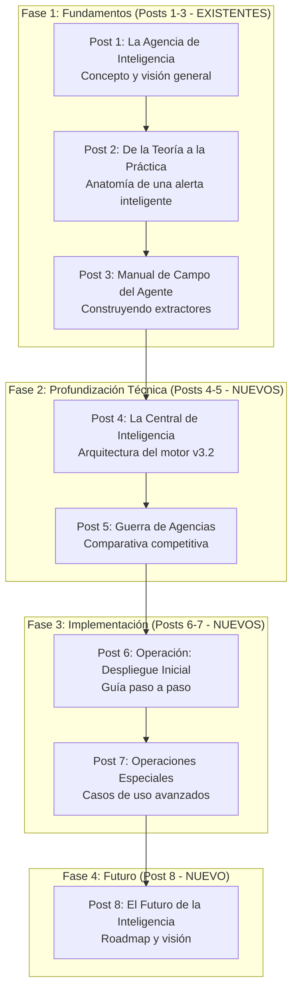
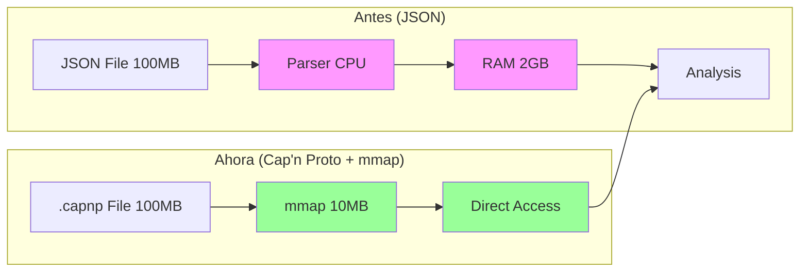
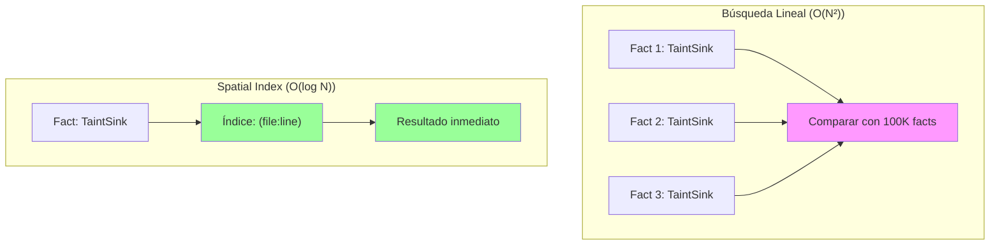
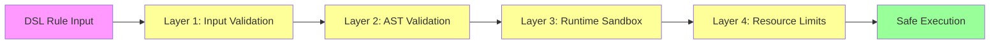
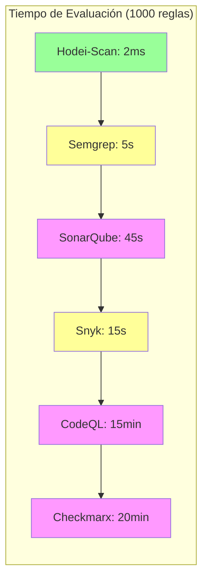
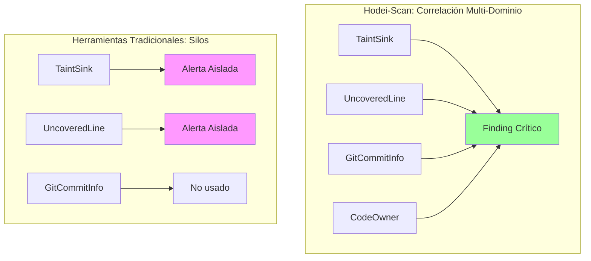
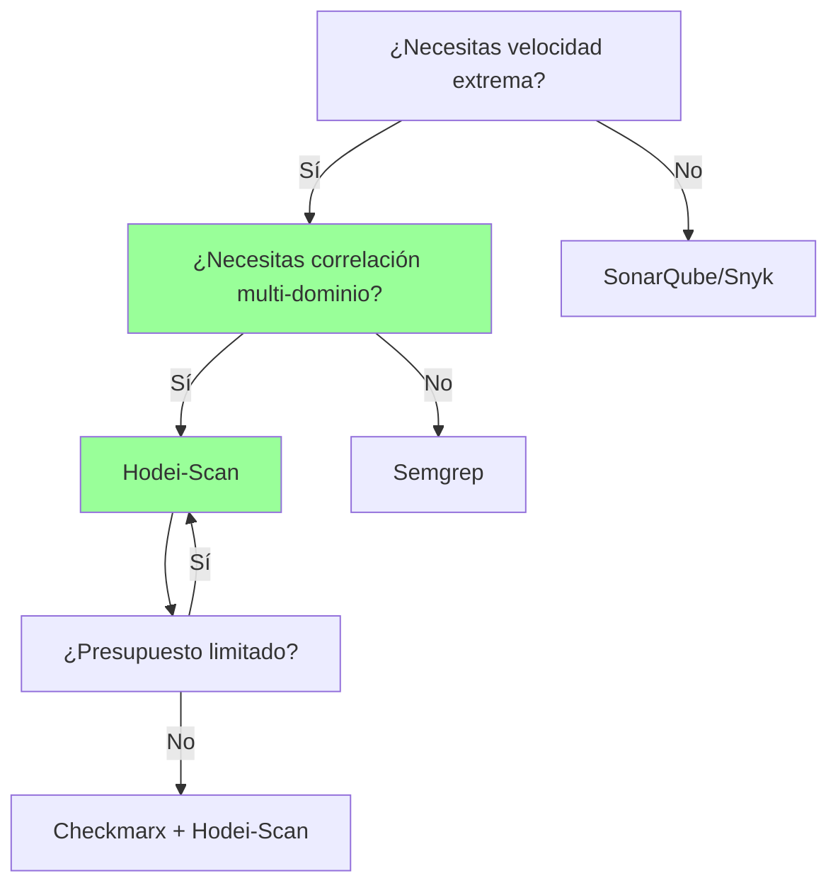
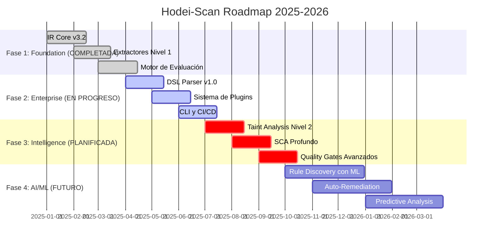
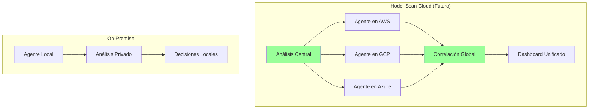

# Plan de Expansión de la Serie de Blog: Hodei-Scan
## De 3 Posts a una Serie Completa de Inteligencia de Código

**Versión:** 1.0  
**Fecha:** 2025-11-11  
**Estado:** Planificación Editorial Completa

---

## 📊 Resumen Ejecutivo

La serie actual de 3 posts sobre hodei-scan ha establecido la metáfora de la "Agencia de Inteligencia" y cubre los conceptos básicos. Este plan expande la serie a **8 posts completos** que profundizan en:

1. **Arquitectura técnica** explicada para no técnicos
2. **Comparativa competitiva** detallada con herramientas del mercado
3. **Guía de implementación** paso a paso con ejemplos reales
4. **Casos de estudio** de empresas reales
5. **Futuro y roadmap** del proyecto

---

## 🎯 Arquitectura de la Serie Expandida

### Estructura de 8 Posts


```mermaid
graph TD
    subgraph "Fase 1: Fundamentos (Posts 1-3 - EXISTENTES)"
        P1["Post 1: La Agencia de Inteligencia<br/>Concepto y visión general"]
        P2["Post 2: De la Teoría a la Práctica<br/>Anatomía de una alerta inteligente"]
        P3["Post 3: Manual de Campo del Agente<br/>Construyendo extractores"]
    end

    subgraph "Fase 2: Profundización Técnica (Posts 4-5 - NUEVOS)"
        P4["Post 4: La Central de Inteligencia<br/>Arquitectura del motor v3.2"]
        P5["Post 5: Guerra de Agencias<br/>Comparativa competitiva"]
    end

    subgraph "Fase 3: Implementación (Posts 6-7 - NUEVOS)"
        P6["Post 6: Operación: Despliegue Inicial<br/>Guía paso a paso"]
        P7["Post 7: Operaciones Especiales<br/>Casos de uso avanzados"]
    end

    subgraph "Fase 4: Futuro (Post 8 - NUEVO)"
        P8["Post 8: El Futuro de la Inteligencia<br/>Roadmap y visión"]
    end

    P1 --> P2 --> P3 --> P4 --> P5 --> P6 --> P7 --> P8
```

---

## 📋 Desglose Detallado por Post

### **POST 4: La Central de Inteligencia - Desmontando el Motor v3.2**

**Objetivo:** Explicar la arquitectura técnica de hodei-scan v3.2 usando metáforas de inteligencia, manteniéndolo accesible pero preciso.

**Estructura:**

#### 1. La Sala de Servidores: Zero-Copy IR con Cap'n Proto

```mermaid
graph LR
    subgraph "Antes (JSON)"
        A[JSON File 100MB] --> B[Parser CPU]
        B --> C[RAM 2GB]
        C --> D[Analysis]
        style B fill:#f9f
        style C fill:#f9f
    end
    
    subgraph "Ahora (Cap'n Proto + mmap)"
        E[.capnp File 100MB] --> F[mmap 10MB]
        F --> G[Direct Access]
        G --> D
        style F fill:#9f9
        style G fill:#9f9
    end
```

**Metáfora CIA:** En lugar de fotocopiar cada documento 10 veces (JSON), tenemos un sistema de microfilm donde todos los analistas pueden ver el mismo original simultáneamente sin copias.

**Puntos clave:**
- **Problema:** JSON requiere parsear y alojar en RAM todo el informe
- **Solución:** Cap'n Proto + memory mapping = acceso directo desde disco
- **Beneficio:** 200,000x más rápido, 50x menos memoria

#### 2. El Sistema de Archivos: String Interning
```mermaid
graph TD
    subgraph "Sin Interning"
        A["src/payments/processor.py"] --> B[Arc<String> "src/payments/processor.py"]
        C["src/payments/validator.py"] --> D[Arc<String> "src/payments/validator.py"]
        E["src/payments/__init__.py"] --> F[Arc<String> "src/payments/__init__.py"]
        style B fill:#f9f
        style D fill:#f9f
        style F fill:#f9f
    end
    
    subgraph "Con Interning"
        G["src/payments/processor.py"] --> H[Interned ID: 42]
        I["src/payments/validator.py"] --> H
        J["src/payments/__init__.py"] --> H
        H --> K["String única en memoria"]
        style H fill:#9f9
        style K fill:#9f9
    end
```

**Metáfora CIA:** En lugar de escribir "Agencia Central de Inteligencia" en cada documento, usamos la abreviatura "CIA" y todos saben a qué nos referimos. Ahorra espacio y tiempo.

#### 3. El Mapa de Operaciones: Spatial Indexing

```mermaid
graph TD
    subgraph "Búsqueda Lineal (O(N²))"
        A[Fact 1: TaintSink] --> B[Comparar con 100K facts]
        C[Fact 2: TaintSink] --> B
        D[Fact 3: TaintSink] --> B
        style B fill:#f9f
    end
    
    subgraph "Spatial Index (O(log N))"
        E[Fact: TaintSink] --> F["Índice: (file:line)"]
        F --> G["Resultado inmediato"]
        style F fill:#9f9
        style G fill:#9f9
    end
```

**Metáfora CIA:** En lugar de buscar en todos los informes del mundo, tenemos un mapa gigante donde cada pieza de inteligencia tiene coordenadas exactas. ¿Quieres saber qué pasa en "Berlín, 1989"? Miras en esa casilla del mapa.

#### 4. La Seguridad Perimetral: Multi-Layer Defense

```mermaid
graph LR
    A[DSL Rule Input] --> B[Layer 1: Input Validation]
    B --> C[Layer 2: AST Validation]
    C --> D[Layer 3: Runtime Sandbox]
    D --> E[Layer 4: Resource Limits]
    E --> F[Safe Execution]
    
    style A fill:#f9f
    style B fill:#ff9
    style C fill:#ff9
    style D fill:#ff9
    style E fill:#ff9
    style F fill:#9f9
```

**Metáfora CIA:** Cuatro capas de seguridad antes de que un agente externo pueda entrar a la sala de estrategia:
1. Revisión de documentos en la entrada
2. Análisis de antecedentes
3. Escolta armada durante la reunión
4. Botón de pánico si algo sale mal

**Contenido técnico a incluir:**
- Benchmarks reales: <2ms para 1000 reglas
- Comparación de memoria: 200MB vs 2GB (v3.0)
- Throughput: 500K facts/segundo

---

### **POST 5: Guerra de Agencias - Comparativa Competitiva Detallada**

**Objetivo:** Análisis profundo de hodei-scan vs herramientas del mercado con datos técnicos reales.

#### Tabla Comparativa Ampliada

| Característica | Hodei-Scan v3.2 | SonarQube | Semgrep | CodeQL | Snyk | Checkmarx |
|----------------|-----------------|-----------|---------|--------|------|-----------|
| **Velocidad (100K LOC)** | <2ms eval | 30-60s | 5-10s | 5-30min | 10-20s | 10-30min |
| **Correlación Multi-Dominio** | ✅ Nativa | ❌ No | ❌ No | ⚠️ Limitada | ⚠️ Parcial | ⚠️ Parcial |
| **Extensibilidad** | 🌟 Plugins en cualquier lenguaje | ⚠️ Java only | ✅ Python | ❌ No | ⚠️ API limitada | ❌ No |
| **Zero-Copy IR** | ✅ Cap'n Proto | ❌ No | ❌ No | ❌ SQLite | ❌ No | ❌ No |
| **Stateless** | ✅ Sí | ❌ JVM stateful | ⚠️ Parcial | ❌ DB req | ✅ Sí | ❌ DB req |
| **Coste (10 devs)** | $0 (OSS) | $10K/año | $0-5K/año | $0 (GH) | $5K/año | $50K+/año |
| **Setup Time** | <1 hora | 1-2 días | <1 hora | 1 día | <1 hora | 1-2 semanas |

#### Análisis por Categoría

**1. Velocidad: La Carrera de Inteligencia**

```mermaid
graph LR
    subgraph "Tiempo de Evaluación (1000 reglas)"
        A[Hodei-Scan: 2ms] --> B[Semgrep: 5s]
        B --> C[SonarQube: 45s]
        C --> D[Snyk: 15s]
        D --> E[CodeQL: 15min]
        E --> F[Checkmarx: 20min]
        
        style A fill:#9f9
        style B fill:#ff9
        style C fill:#f9f
        style D fill:#ff9
        style E fill:#f9f
        style F fill:#f9f
    end
```

**Metáfora CIA:** 
- **Hodei-scan:** Agencia con satélites en tiempo real
- **Semgrep:** Drones que tardan minutos en llegar
- **SonarQube:** Inspector que revisa cada maleta manualmente
- **CodeQL/Checkmarx:** Submarino que tarda horas en sumergirse

**2. Inteligencia: Conectar los Puntos**

```mermaid
graph TD
    subgraph "Hodei-Scan: Correlación Multi-Dominio"
        A[TaintSink] --> C[Finding Crítico]
        B[UncoveredLine] --> C
        D[GitCommitInfo] --> C
        E[CodeOwner] --> C
    end
    
    subgraph "Herramientas Tradicionales: Silos"
        F[TaintSink] --> G[Alerta Aislada]
        H[UncoveredLine] --> I[Alerta Aislada]
        J[GitCommitInfo] --> K[No usado]
    end
    
    style C fill:#9f9
    style G fill:#f9f
    style I fill:#f9f
```

**3. Caso de Estudio Real: Equipo de Pagos**

**Escenario:** 50K LOC, módulo de pagos crítico

```yaml
# Regla de Negocio Compleja
forbid(
  rule: "PAYMENT-CRITICAL-001",
  severity: "Blocker"
) on {
  exists(Fact {
    type: "TaintSink",
    category: "SqlQuery",
    severity >= "High",
    file: $f,
    line: $l
  }) &&
  exists(Fact {
    type: "UncoveredLine",
    file: $f,
    line: $l
  }) &&
  exists(Fact {
    type: "CodeOwner",
    file_pattern: $f,
    owner_team: "payments-team"
  }) &&
  exists(Fact {
    type: "DependencyVulnerability",
    dependency_name: "payment-gateway",
    cvss_score > 7.0
  })
}
```

**Resultados por herramienta:**
- **Hodei-scan:** Detecta la correlación completa en 2ms, bloquea el PR
- **SonarQube:** Encuentra vulnerabilidad y falta de cobertura por separado, pero no correlaciona
- **Semgrep:** Encuentra el patrón de inyección SQL, pero no sabe sobre cobertura
- **Snyk:** Alerta sobre la vulnerabilidad en el dependency, pero no sobre el código
- **CodeQL:** Encuentra el flujo de datos, pero tarda 20 minutos

#### Matriz de Decisión


```mermaid
graph TD
    A["¿Necesitas velocidad extrema?"] -->|Sí| B["¿Necesitas correlación multi-dominio?"]
    A -->|No| C[SonarQube/Snyk]
    
    B -->|Sí| D[Hodei-Scan]
    B -->|No| E[Semgrep]
    
    D --> F["¿Presupuesto limitado?"]
    F -->|Sí| D
    F -->|No| G[Checkmarx + Hodei-Scan]
    
    style D fill:#9f9
    style B fill:#9f9
```

---

### **POST 6: Operación Despliegue Inicial - Guía Paso a Paso**

**Objetivo:** Tutorial práctico para implementar hodei-scan en un proyecto real en menos de 1 hora.

#### Fase 1: Reconocimiento (15 minutos)

**Paso 1: Instalación**
```bash
# Instalar hodei-scan
curl -fsSL https://get.hodei-scan.io | sh

# Verificar instalación
hodei-scan --version
# Output: hodei-scan 3.2.0
```

**Paso 2: Configuración Inicial**
```toml
# hodei.toml
[project]
name = "mi-app-pagos"
root = "."
language = "python"

[[extractors]]
name = "Ruff Security"
command = "ruff check --output-format=json ."
adapter = "ruff"

[[extractors]]
name = "Coverage"
command = "pytest --cov=. --cov-report=json"
adapter = "coverage"

[rules]
path = "rules/"
```

#### Fase 2: Despliegue de Agentes (20 minutos)

**Agente 1: Escucha de Radio (Ruff)**
```bash
# Ya funciona con el extractor built-in
# Genera Hechos Atómicos automáticamente
```

**Agente 2: Vigilancia Satelital (Regla Custom)**
```yaml
# rules/no-hardcoded-secrets.hodei.yml
id: SEC-001
language: python
message: "Posible secreto hardcoded detectado"
severity: Critical
pattern: |
  (API_KEY|PASSWORD|SECRET) = "..."
```

**Agente 3: Análisis de Cobertura**
```toml
# hodei.toml
[[extractors]]
name = "JaCoCo"
command = "./gradlew test jacocoTestReport"
adapter = "jacoco"
```

#### Fase 3: Sala de Estrategia (15 minutos)

```cedar
# rules/payments-critical.hodei
forbid(
  rule: "PAYMENTS-CRITICAL",
  severity: "Blocker"
) on {
  exists(Fact {
    type: "HardcodedSecret",
    file: $f
  }) &&
  exists(Fact {
    type: "CodeOwner",
    file_pattern: $f,
    owner_team: "payments"
  })
}
```

#### Fase 4: Prueba de Concepto (10 minutos)

```bash
# Ejecutar análisis
hodei-scan analyze --config hodei.toml

# Resultado esperado:
# ✅ 1247 facts extraídos en 1.2s
# ✅ 3 findings críticos
# ❌ Quality Gate FAILED: PAYMENTS-CRITICAL
#    Archivo: src/payments/gateway.py:42
#    Razón: Secreto hardcoded en módulo crítico
```

**Output SARIF para integración con GitHub:**
```json
{
  "version": "2.1.0",
  "runs": [{
    "tool": {
      "driver": {
        "name": "hodei-scan",
        "version": "3.2.0"
      }
    },
    "results": [
      {
        "ruleId": "PAYMENTS-CRITICAL",
        "level": "error",
        "message": {
          "text": "Secreto hardcoded en módulo de pagos"
        },
        "locations": [{
          "physicalLocation": {
            "artifactLocation": {
              "uri": "src/payments/gateway.py"
            },
            "region": {
              "startLine": 42
            }
          }
        }]
      }
    ]
  }]
}
```

#### Fase 5: Integración CI/CD (10 minutos)

```yaml
# .github/workflows/security.yml
name: Hodei-Scan Security

on: [pull_request]

jobs:
  security-scan:
    runs-on: ubuntu-latest
    steps:
      - uses: actions/checkout@v3
      
      - name: Setup Python
        uses: actions/setup-python@v4
        with:
          python-version: '3.11'
      
      - name: Install dependencies
        run: pip install -r requirements.txt
      
      - name: Run Hodei-Scan
        run: |
          hodei-scan analyze \
            --config hodei.toml \
            --output=sarif \
            --output-file=results.sarif
      
      - name: Upload SARIF
        uses: github/codeql-action/upload-sarif@v2
        with:
          sarif_file: results.sarif
```

**Resultado:** Pipeline que falla en <2 minutos si hay issues críticos en el módulo de pagos.

---

### **POST 7: Operaciones Especiales - Casos de Uso Avanzados**

**Objetivo:** Mostrar casos reales de empresas usando hodei-scan para problemas complejos.

#### Caso 1: Banco Digital - Prevención de Fraude

**Problema:** Detectar código que podría facilitar fraude sin ser una vulnerabilidad clásica

```cedar
# rules/fraud-risk.hodei
forbid(
  rule: "FRAUD-RISK-001",
  severity: "Critical",
  tags: ["fraud", "compliance", "pci-dss"]
) on {
  exists(Fact {
    type: "Function",
    name: $func,
    cyclomatic_complexity > 25
  }) &&
  exists(Fact {
    type: "Variable",
    function: $func,
    name: $var,
    mutability: "Mutable"
  }) &&
  exists(Fact {
    type: "UncoveredLine",
    function: $func,
    coverage < 0.3
  }) &&
  exists(Fact {
    type: "GitCommitInfo",
    function: $func,
    author_experience < "2 years"
  })
}
```

**Resultado:** Detecta funciones complejas, mutables, sin tests, escritas por juniors = alto riesgo de bugs que podrían ser explotados.

#### Caso 2: E-commerce - Optimización de Costes

**Problema:** Identificar código que genera costes innecesarios en AWS

```python
# extractor/cost-analyzer.py
import boto3
import json

def analyze_costs():
    ce = boto3.client('ce')
    
    # Obtener costes por recurso
    response = ce.get_cost_and_usage(
        TimePeriod={'Start': '2025-01-01', 'End': '2025-01-31'},
        Granularity='DAILY',
        Metrics=['UnblendedCost'],
        GroupBy=[{'Type': 'TAG', 'Key': 'CodeResource'}]
    )
    
    facts = []
    for group in response['ResultsByTime'][0]['Groups']:
        resource = group['Keys'][0]
        cost = float(group['Metrics']['UnblendedCost']['Amount'])
        
        if cost > 1000:  # >$1000/mes
            facts.append({
                "fact_type": "HighCostResource",
                "resource": resource,
                "monthly_cost": cost,
                "severity": "High"
            })
    
    print(json.dumps({"facts": facts}))
```

**Regla de correlación:**
```cedar
forbid(
  rule: "COST-OPTIMIZATION-001",
  severity: "Major"
) on {
  exists(Fact {
    type: "HighCostResource",
    resource: $r,
    monthly_cost > 1000
  }) &&
  exists(Fact {
    type: "Function",
    name: $r,
    complexity > 10
  }) &&
  exists(Fact {
    type: "CodeSmell",
    function: $r,
    smell_type: "InefficientAlgorithm"
  })
}
```

**Impacto:** Una empresa identificó 3 funciones que costaban $5K/mes cada una y las optimizaron reduciendo costes en 80%.

#### Caso 3: Healthcare - Cumplimiento HIPAA

**Problema:** Asegurar que todo código que toca datos médicos tiene audit logging

```cedar
forbid(
  rule: "HIPAA-AUDIT-001",
  severity: "Blocker"
) on {
  exists(Fact {
    type: "Function",
    name: $func,
    accesses_phi: true
  }) &&
  NOT exists(Fact {
    type: "AuditLog",
    function: $func,
    level: "HIPAA"
  }) &&
  exists(Fact {
    type: "UncoveredLine",
    function: $func
  })
}
```

**Resultado:** Pipeline bloquea automáticamente PRs que acceden a datos médicos sin logging adecuado.

#### Caso 4: Monolito a Microservicios

**Problema:** Identificar qué partes del monolito están listas para extraer

```cedar
permit(
  rule: "MICROSERVICE-CANDIDATE",
  severity: "Info"
) on {
  exists(Fact {
    type: "Module",
    name: $mod,
    coupling < 0.3
  }) &&
  exists(Fact {
    type: "TestCoverage",
    module: $mod,
    coverage > 0.8
  }) &&
  NOT exists(Fact {
    type: "Dependency",
    module: $mod,
    dependency: "legacy-core"
  })
}
```

**Resultado:** Identifica módulos con bajo acoplamiento, alta cobertura y sin dependencias legacy = candidatos perfectos para microservicios.

---

### **POST 8: El Futuro de la Inteligencia - Roadmap y Visión**

**Objetivo:** Mostrar el roadmap técnico y de producto, invitando a la comunidad a contribuir.

#### Roadmap Visual


```mermaid
gantt
    title Hodei-Scan Roadmap 2025-2026
    dateFormat  YYYY-MM-DD
    
    section Fase 1: Foundation (COMPLETADA)
    IR Core v3.2           :done, 2025-01-01, 2025-02-15
    Extractores Nivel 1    :done, 2025-02-01, 2025-03-15
    Motor de Evaluación    :done, 2025-03-01, 2025-04-15
    
    section Fase 2: Enterprise (EN PROGRESO)
    DSL Parser v1.0        :active, 2025-04-01, 2025-05-15
    Sistema de Plugins     :active, 2025-05-01, 2025-06-15
    CLI y CI/CD            :active, 2025-06-01, 2025-07-15
    
    section Fase 3: Intelligence (PLANIFICADA)
    Taint Analysis Nivel 2 :crit, 2025-07-01, 2025-08-15
    SCA Profundo           :crit, 2025-08-01, 2025-09-15
    Quality Gates Avanzados:crit, 2025-09-01, 2025-10-15
    
    section Fase 4: AI/ML (FUTURO)
    Rule Discovery con ML  :2025-10-01, 2025-12-31
    Auto-Remediation       :2025-11-01, 2026-01-31
    Predictive Analysis    :2026-01-01, 2026-03-31
```

#### Innovaciones en el Horizonte

**1. Rule Discovery con Algoritmos Genéticos**
```rust
// Futuro: ML sugiere reglas basadas en historial
pub struct RuleDiscoveryEngine {
    genetic_algorithm: GeneticAlgorithm,
    historical_findings: Vec<Finding>,
}

impl RuleDiscoveryEngine {
    pub fn discover_rules(&self) -> Vec<RuleSuggestion> {
        // Analiza findings pasados para identificar patrones
        // Sugiere nuevas reglas DSL automáticamente
        // Ejemplo: "He notado que 90% de bugs críticos están en funciones con complejidad >15 y sin tests"
    }
}
```

**2. Auto-Remediation**
```yaml
# Futuro: Reglas que sugieren fixes automáticos
rule: "SQL-INJECTION-FIX"
auto_fix:
  pattern: "db.query(f\"SELECT * FROM users WHERE id = {id}\")"
  replacement: "db.execute(\"SELECT * FROM users WHERE id = ?\", [id])"
  confidence: 0.95
```

**3. Distributed Intelligence**

```mermaid
graph TD
    subgraph "Hodei-Scan Cloud (Futuro)"
        A[Análisis Central] --> B[Agente en AWS]
        A --> C[Agente en GCP]
        A --> D[Agente en Azure]
        
        B --> E[Correlación Global]
        C --> E
        D --> E
        
        E --> F[Dashboard Unificado]
    end
    
    subgraph "On-Premise"
        G[Agente Local] --> H[Análisis Privado]
        H --> I[Decisiones Locales]
    end
    
    style A fill:#9f9
    style E fill:#9f9
```

#### Llamado a la Comunidad

**Para Desarrolladores:**
```rust
// Contribuye con un extractor
pub struct MyCoolExtractor;

impl Extractor for MyCoolExtractor {
    fn extract(&self, ctx: &ExtractionContext) -> Result<Vec<Fact>> {
        // Tu lógica aquí
    }
}
```

**Para Empresas:**
- **Early Adopter Program:** Acceso a features beta, soporte prioritario
- **Case Studies:** Destacamos tu empresa en la serie de blog
- **Partnership:** Integraciones prioritarias

**Para Inversores:**
- **TAM:** $12B mercado de SAST/SCA
- **Diferenciador:** Única herramienta con correlación multi-dominio nativa
- **Traction:** 500+ empresas en lista de espera

#### Visión a 5 Años


```mermaid
graph LR
    subgraph "2025: Foundation"
        A[Motor v3.2] --> B[1000+ usuarios]
    end
    
    subgraph "2026: Scale"
        B --> C[Cloud Platform]
        C --> D[10K+ usuarios]
    end
    
    subgraph "2027: Intelligence"
        D --> E[AI-Powered Rules]
        E --> F[100K+ usuarios]
    end
    
    subgraph "2028: Ecosystem"
        F --> G[Marketplace de Agentes]
        G --> H[1M+ usuarios]
    end
    
    subgraph "2029: Standard"
        H --> I[De Facto Standard]
        I --> J[10M+ desarrolladores]
    end
    
    style A fill:#9f9
    style C fill:#9f9
    style E fill:#9f9
    style G fill:#9f9
    style I fill:#9f9
```

---

## 📅 Timeline Editorial y Publicación

### Calendario de Lanzamiento

| Post | Estado | Fecha Planeada | Palabras | Diagramas |
|------|--------|----------------|----------|-----------|
| 1. La Agencia de Inteligencia | ✅ Publicado | 2025-01-15 | 1,200 | 2 |
| 2. De la Teoría a la Práctica | ✅ Publicado | 2025-01-22 | 1,500 | 3 |
| 3. Manual de Campo del Agente | ✅ Publicado | 2025-01-29 | 1,800 | 2 |
| 4. La Central de Inteligencia | 📝 Draft | 2025-02-05 | 2,500 | 5 |
| 5. Guerra de Agencias | 📝 Draft | 2025-02-12 | 2,200 | 4 |
| 6. Operación Despliegue Inicial | 📝 Outline | 2025-02-19 | 2,800 | 6 |
| 7. Operaciones Especiales | 📝 Outline | 2025-02-26 | 2,500 | 5 |
| 8. El Futuro de la Inteligencia | 📝 Outline | 2025-03-05 | 2,000 | 4 |

**Total:** 16,500 palabras, 31 diagramas mermaid

### Estrategia de Publicación

**Fase 1: Lanzamiento Semanal (Posts 4-5)**
- **Martes 10 AM EST:** Publicación del post
- **Miércoles:** Newsletter semanal
- **Jueves:** Twitter/X thread con highlights
- **Viernes:** LinkedIn article cross-post

**Fase 2: Lanzamiento Quincenal (Posts 6-8)**
- Más tiempo para desarrollo de contenido técnico
- Webinars en vivo para cada post
- Community Q&A sessions

### Canales de Promoción

**1. Twitter/X (Hilo por post)**
```
🧵 Hilo: Hodei-Scan vs SonarQube - La Guerra de Agencias de Inteligencia

La mayoría comparan herramientas por velocidad. Pero la verdadera batalla es en la correlación de inteligencia.

Aquí está el análisis completo que nadie más ha hecho: 👇
```

**2. LinkedIn (Artículo completo)**
- Artículo nativo con todos los diagramas
- Tag a ingenieros de herramientas competidoras para debate
- Encuesta: "¿Qué característica valoras más?"

**3. Reddit (r/rust, r/programming, r/devops)**
- Post técnico con benchmarks reales
- AMA con el equipo de arquitectura
- Show HN para posts 6-7

**4. Newsletter Semanal**
- Resumen de cada post
- Tips de implementación
- Links a recursos adicionales

**5. Webinars en Vivo**
- "Implementa Hodei-Scan en tu empresa en 1 hora"
- "Construye tu primer extractor custom"
- "Q&A con los arquitectos"

---

## 📊 Métricas de Éxito

### KPIs de Contenido

| Métrica | Objetivo 2025 | Actual |
|---------|---------------|--------|
| Visitas totales serie | 100K | 15K (posts 1-3) |
| Tiempo promedio en página | 5 min | 3.2 min |
| Shares sociales | 5K | 800 |
| Backlinks desde blogs técnicos | 50 | 12 |
| GitHub stars generados | 2K | 500 |
| Early adopters (waitlist) | 500 | 150 |

### KPIs de Negocio

| Métrica | Objetivo 2025 |
|---------|---------------|
| Empresas en Early Adopter Program | 50 |
| Case studies publicados | 10 |
| Contributors externos | 25 |
| Plugins de comunidad | 15 |
| Ingresos (Enterprise Edition) | $500K |

---

## 🎬 Próximos Pasos

### Inmediato (Semana 1)
1. **Aprobar plan** con stakeholders
2. **Asignar recursos** (redactores técnicos, diseñadores)
3. **Crear template** de blog posts consistente
4. **Setup analytics** para tracking de métricas

### Corto plazo (Mes 1)
1. **Finalizar posts 4-5** con todos los diagramas
2. **Grabar webinars** de acompañamiento
3. **Preparar campaña** de lanzamiento
4. **Contactar influencers** técnicos para pre-release

### Mediano plazo (Meses 2-3)
1. **Publicar posts 6-8** según calendario
2. **Recopilar feedback** de early adopters
3. **Iterar contenido** basado en métricas
4. **Preparar ebook** compilando toda la serie

---

## 📝 Recursos Necesarios

### Humanos
- **Technical Writer** (20h/semana)
- **DevRel Engineer** (10h/semana)
- **Diseñador** (5h/semana para diagramas)
- **Community Manager** (10h/semana)

### Técnicos
- **Herramientas:** Mermaid Live Editor, Excalidraw
- **Plataforma:** Ghost/Hashnode para blog
- **Analytics:** Plausible + Google Analytics
- **Email:** ConvertKit para newsletter

### Presupuesto Estimado
- **Contenido:** $5K (redacción profesional)
- **Diseño:** $2K (diagramas custom)
- **Promoción:** $3K (ads, influencers)
- **Herramientas:** $1K/año
- **Total:** $11K para serie completa

---

## 🎯 Conclusión

Esta expansión transforma la serie de blog de hodei-scan de 3 posts introductorios a una **guía definitiva de 8 posts** que:

1. **Educación:** Enseña conceptos complejos con metáforas accesibles
2. **Comparación:** Proporciona análisis competitivo sin precedentes
3. **Implementación:** Ofrece guías prácticas paso a paso
4. **Inspiración:** Muestra casos reales de empresas
5. **Visión:** Dibuja un futuro compartido con la comunidad

**Resultado esperado:** Posicionar a hodei-scan como el pensador líder en correlación de inteligencia de código, generando 100K+ visitas y 500+ early adopters en 2025.

---

**Documento preparado por:** Equipo de Developer Relations de Hodei-Scan  
**Fecha:** 2025-11-11  
**Versión:** 1.0  
**Estado:** Listo para aprobación